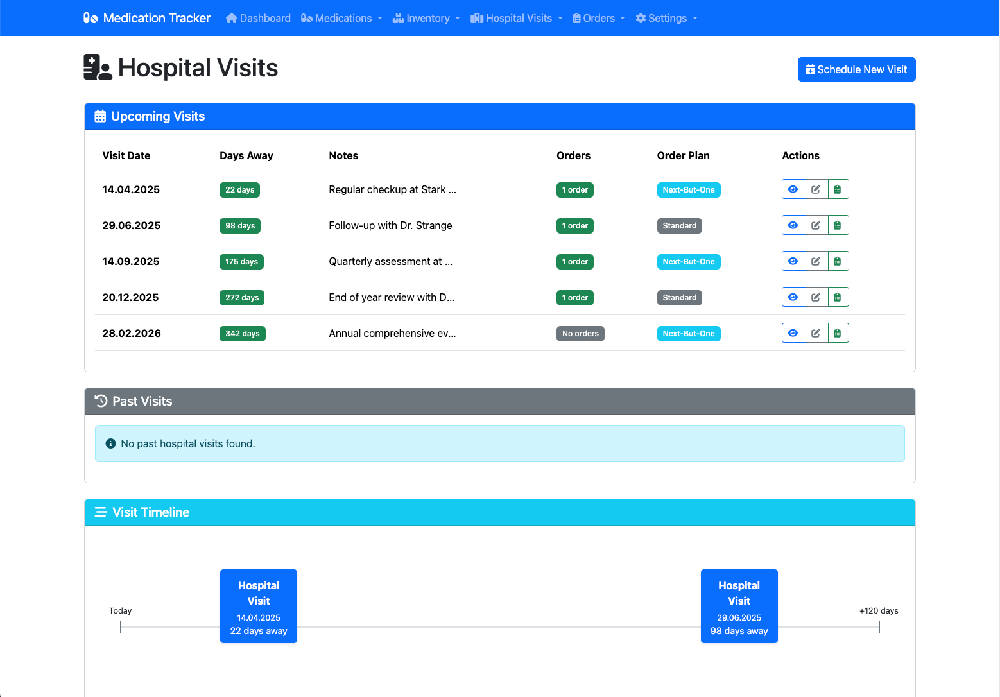

# Medication Tracker

A lightweight Python-based web application hosted on Docker that helps track medications, inventory levels, and prepare for hospital visits.

## Features

- Medication management with dosage and frequency tracking
- Inventory tracking with warnings for low stock
- Hospital visit planning with medication needs calculation
- Package size optimization for prescription orders
- Printable order forms for hospital visits

## Screenshots

### Dashboard


### Medication Details


### Inventory Management


### Hospital Visits


## Getting Started

### Prerequisites

- Docker and Docker Compose

### Installation with Docker

1. Clone this repository
```bash
git clone https://github.com/yourusername/medication-tracker.git
cd medication-tracker
```

2. Build and start the container
```bash
docker-compose up -d
```

3. Access the application at http://localhost:8087

### Installation for Development

To set up a development environment:

1. Create a virtual environment
```bash
python -m venv venv
```

2. Activate it
```bash
# On Windows
venv\Scripts\activate

# On macOS/Linux
source venv/bin/activate
```

3. Install dependencies
```bash
pip install -r requirements.txt
```

4. Run the application
```bash
python app/main.py
```

5. Access the application at http://localhost:8080

## Usage Guide

### Adding Medications

1. Navigate to "Medications" -> "Add Medication"
2. Enter medication details including:
   - Name, dosage, and frequency
   - Package sizes (N1, N2, N3)
   - Minimum threshold for alerts
   - Safety margin days for calculations

### Managing Inventory

1. Navigate to "Inventory" -> "Inventory Overview"
2. Use the quick adjust buttons to update inventory
3. View low stock warnings and depletion forecasts

### Scheduling Hospital Visits

1. Navigate to "Hospital Visits" -> "Schedule Visit"
2. Enter the date of your upcoming visit
3. Optionally create an order for the visit

### Creating Orders

1. Navigate to "Orders" -> "New Order"
2. Select medications needed until your next visit
3. Review and submit the order
4. Print the order for your hospital visit
5. Mark as fulfilled when medications are received

## Data Structure

The application uses SQLite for data storage with the following structure:

- **Medications**: Name, dosage, frequency, package sizes
- **Inventory**: Current stock levels and adjustment history
- **Hospital Visits**: Upcoming and past visit records
- **Orders**: Medication orders linked to hospital visits

## License

This project is licensed under the MIT License - see the LICENSE file for details.

## Acknowledgments

- Flask web framework
- Bootstrap for the responsive UI
- SQLAlchemy for database operations