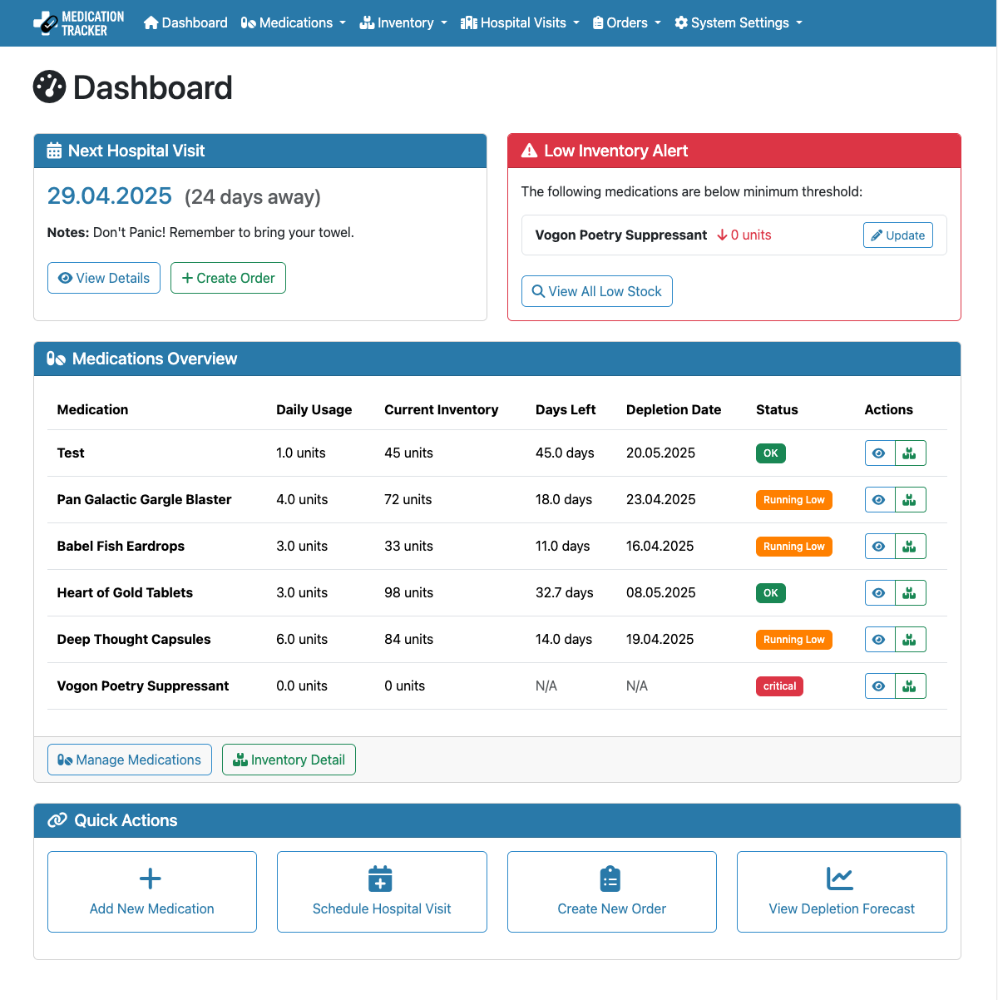
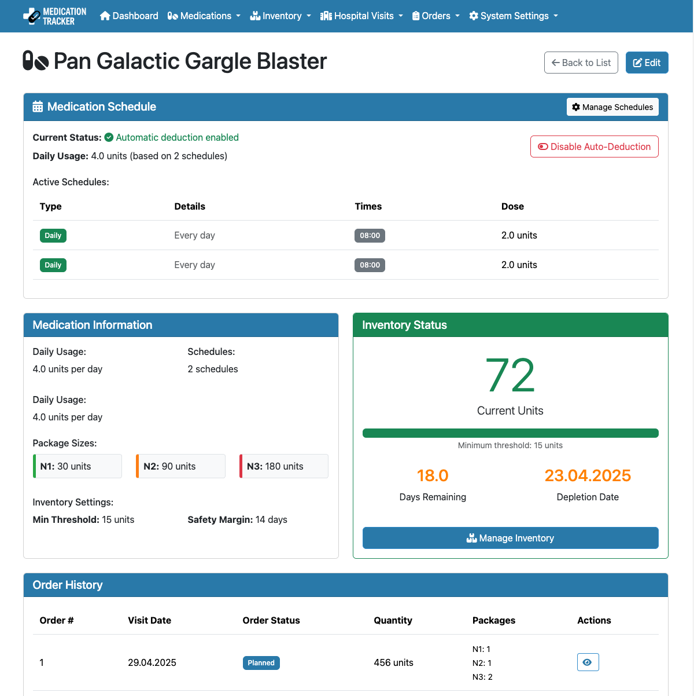
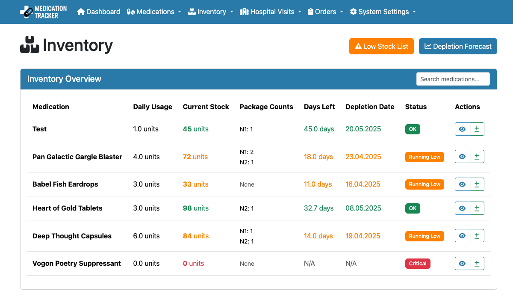
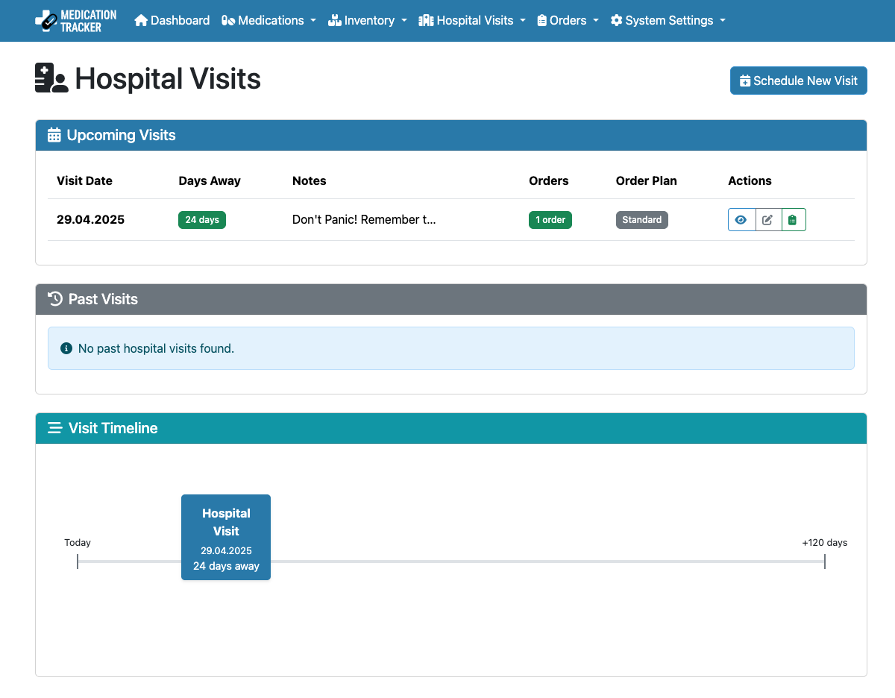

<p align="center">
  
</p>

A lightweight Python-based web application that helps track medications, inventory levels, and prepare for physician visits, using SQLite for data storage.

[](https://hub.docker.com/r/skjall/medication-tracker)
[](https://opensource.org/licenses/MIT)

## Features

- **Medication Management**:
  - Track medication dosage, frequency, and package sizes
  - Advanced scheduling options (daily, interval, or specific weekdays)
  - Automatic inventory deduction based on schedules

- **Inventory Tracking**:
  - Real-time inventory monitoring with low stock warnings
  - Package-based inventory management (N1, N2, N3 sizes)
  - Full history of inventory changes with timestamps

- **Physician Management**:
  - Organize medications by prescribing physician
  - Track physician specialties, contact information, and notes
  - Associate visits with specific physicians
  - Mark medications as Over-The-Counter (OTC) or supplements

- **Physician Visit Planning**:
  - Schedule and manage upcoming physician visits
  - Calculate medication needs until next visit
  - Support for next-but-one visit planning

- **Order Management**:
  - Create medication orders for physician visits
  - Calculate package requirements based on needs
  - Generate printable order forms
  - Track order fulfillment and update inventory

- **Data Management**:
  - Import/export data for all system components
  - CSV import/export for medications, inventory, visits, and orders
  - Database backup and optimization tools

## Access Warning

⚠️ **This software has no access protection. Users are advised to not expose any sensitive information and to only deploy it on local networks or behind appropriate security measures. The application is intended for personal use and should not be publicly accessible.**

## Screenshots

### Dashboard


### Medication Details


### Inventory Management


### Physician Visits


# Running the application

## Using Docker

```bash
docker run -d \
  --name medication-tracker \
  -p 8087:8087 \
  -v medication_tracker_data:/app/data \
  -v medication_tracker_logs:/app/logs \
  -e SECRET_KEY=your_secure_secret_key \
  skjall/medication-tracker:latest
```

Then access the application at http://localhost:8087

## Using Docker Compose

1. Create a docker-compose.yml file:

```yaml
version: '3.8'

services:
  medication-tracker:
    image: skjall/medication-tracker:latest
    container_name: medication-tracker
    ports:
      - '8087:8087'
    volumes:
      - medication_tracker_data:/app/data
      - medication_tracker_logs:/app/logs
    restart: unless-stopped
    environment:
      - FLASK_ENV=production
      - SECRET_KEY=change_me_in_production
      - LOG_LEVEL=INFO

volumes:
  medication_tracker_data:
  medication_tracker_logs:
```

2. Start the application:

```bash
docker-compose up -d
```

3. Access the application at http://localhost:8087

## Environment Variables

- `SECRET_KEY`: Secret key for session signing (required in production)
- `FLASK_ENV`: Set to `production` for production use
- `LOG_LEVEL`: Set logging level (`DEBUG`, `INFO`, `WARNING`, `ERROR`, or `CRITICAL`)

## Data Persistence

All data is stored in SQLite databases in the `/app/data` directory. To persist your data, mount this directory as a volume.

## Usage Guide

### Managing Physicians

1. Navigate to "Physicians" → "Add Physician"
2. Enter physician details including name, specialty, and contact information
3. Associate medications with specific physicians during medication creation
4. View all medications and visits for each physician in one place

### Adding Medications

1. Navigate to "Medications" → "Add Medication"
2. Enter medication details including name, dosage, package sizes
3. Select the prescribing physician or mark as Over-The-Counter (OTC)
4. Set up medication schedules to define when and how much to take
5. Enable automatic deduction for seamless inventory management

### Managing Inventory

1. Navigate to "Inventory" → "Inventory Overview"
2. Use the quick adjust buttons to update inventory levels
3. View low stock warnings and depletion forecasts
4. Track inventory changes with detailed history logs

### Scheduling Physician Visits

1. Navigate to "Physician Visits" → "Schedule Visit"
2. Enter the date of your upcoming visit
3. Select the physician you're visiting
4. Optionally create an order for the visit
5. Choose between regular ordering or next-but-one planning

### Creating Orders

1. Navigate to "Orders" → "New Order"
2. Select medications needed until your next visit
3. Review automatically calculated package requirements
4. Generate a printable order form for your physician visit
5. Mark as fulfilled when medications are received to update inventory

## Building from Source

If you want to build the Docker image yourself:

```bash
git clone https://github.com/skjall/medication-tracker.git
cd medication-tracker
docker buildx build -t medication-tracker --build-arg VERSION=$(cat version.txt) .
```

## Versioning

The application follows semantic versioning:

- Main branch: Uses explicit version from `version.txt` file
- Development branch: Auto-generates version with format `dev-YYYYMMDDHHMM-commit`
- Tagged releases: Use the tag version (e.g., `v1.0.0` → `1.0.0`)

To update the version:

```bash
# Increment patch version (1.0.0 → 1.0.1)
./scripts/update_version.sh patch

# Increment minor version (1.0.0 → 1.1.0)
./scripts/update_version.sh minor

# Increment major version (1.0.0 → 2.0.0)
./scripts/update_version.sh major

# Update, commit, and tag in one command
./scripts/update_version.sh patch --commit --tag
```

## Development Setup

To set up a development environment:

1. Clone the repository
2. Create a virtual environment:
   ```bash
   python -m venv .venv
   source .venv/bin/activate  # On Windows: .venv\Scripts\activate
   ```
3. Install dependencies:
   ```bash
   pip install -r requirements.txt
   ```
4. Run the application:
   ```bash
   python app/main.py
   ```
5. Then access the application at http://localhost:8087

## License

This project is licensed under the MIT License - see the [LICENSE.md](LICENSE.md) file for details.