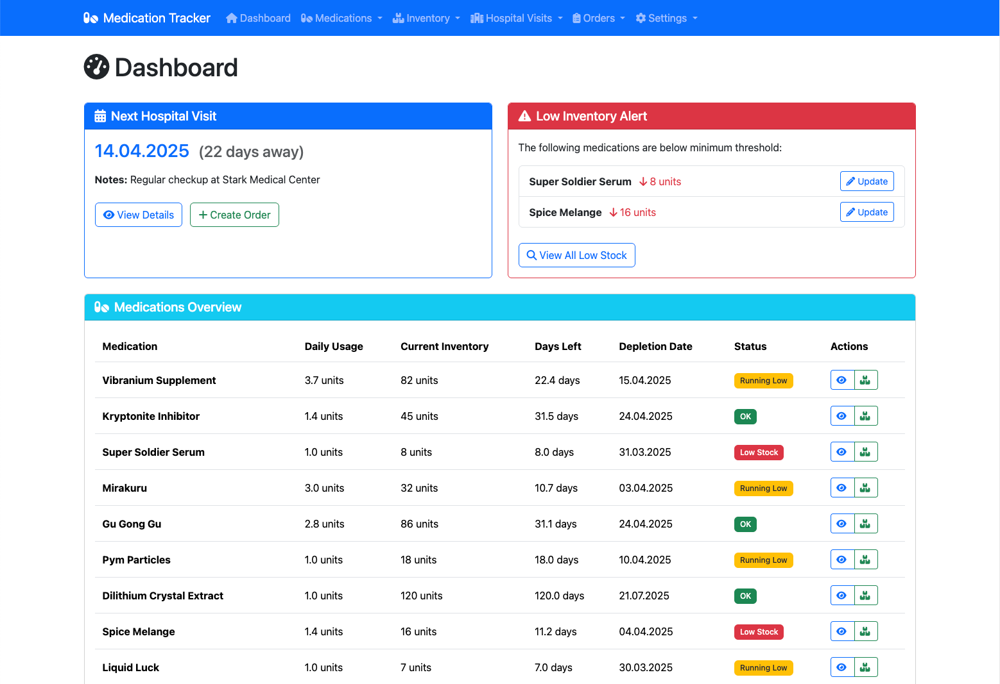
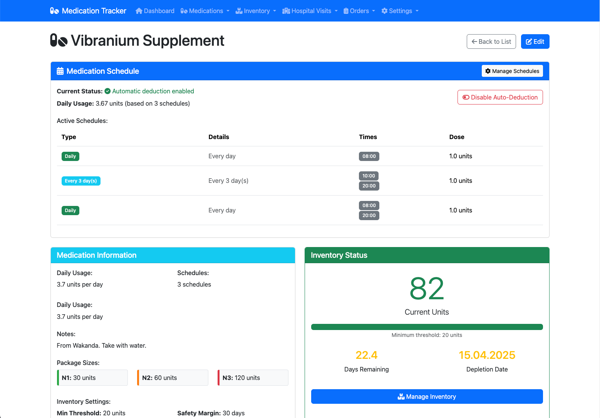
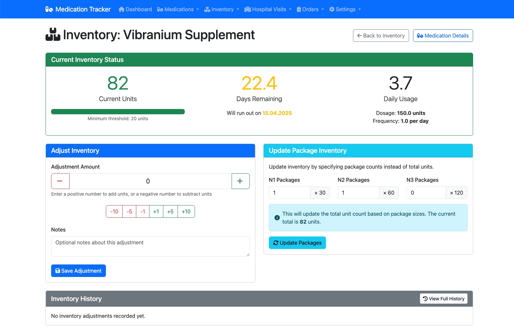

# Medication Tracker

A lightweight Python-based web application hosted on Docker that helps track medications, inventory levels, and prepare for hospital visits.

## Features

- **Medication Management**:
  - Track medication dosage, frequency, and package sizes
  - Advanced scheduling options (daily, interval, or specific weekdays)
  - Automatic inventory deduction based on schedules

- **Inventory Tracking**:
  - Real-time inventory monitoring with low stock warnings
  - Package-based inventory management (N1, N2, N3 sizes)
  - Full history of inventory changes with timestamps

- **Hospital Visit Planning**:
  - Schedule and manage upcoming hospital visits
  - Calculate medication needs until next visit
  - Support for next-but-one visit planning

- **Order Management**:
  - Create medication orders for hospital visits
  - Calculate package requirements based on needs
  - Generate printable order forms
  - Track order fulfillment and update inventory

- **Data Management**:
  - Import/export data for all system components
  - CSV import/export for medications, inventory, visits, and orders
  - Individual data type reset capabilities
  - Database backup and optimization tools

## Screenshots

### Dashboard


### Medication Details


### Inventory Management


### Hospital Visits


## Getting Started

### Prerequisites

- Docker and Docker Compose

### Installation with Docker

1. Clone this repository
```bash
git clone https://github.com/yourusername/medication-tracker.git
cd medication-tracker
```

2. Build and start the container
```bash
docker-compose up -d
```

3. Access the application at http://localhost:8087

### Installation for Development

To set up a development environment:

1. Create a virtual environment
```bash
python -m venv venv
```

2. Activate it
```bash
# On Windows
venv\Scripts\activate

# On macOS/Linux
source venv/bin/activate
```

3. Install dependencies
```bash
pip install -r requirements.txt
```

4. Run the application
```bash
python app/main.py
```

5. Access the application at http://localhost:8087

## Usage Guide

### Adding Medications

1. Navigate to "Medications" -> "Add Medication"
2. Enter medication details including:
   - Name, dosage, and frequency
   - Package sizes (N1, N2, N3)
   - Minimum threshold for alerts
   - Safety margin days for calculations
3. Set up medication schedules to define when and how much to take
4. Enable automatic deduction for seamless inventory management

### Managing Inventory

1. Navigate to "Inventory" -> "Inventory Overview"
2. Use the quick adjust buttons to update inventory levels
3. View low stock warnings and depletion forecasts
4. Track inventory changes with detailed history logs

### Scheduling Hospital Visits

1. Navigate to "Hospital Visits" -> "Schedule Visit"
2. Enter the date of your upcoming visit
3. Optionally create an order for the visit
4. Choose between regular ordering or next-but-one planning

### Creating Orders

1. Navigate to "Orders" -> "New Order"
2. Select medications needed until your next visit
3. Review automatically calculated package requirements
4. Generate a printable order form for your hospital visit
5. Mark as fulfilled when medications are received to update inventory

### Data Management

1. Navigate to "Settings" -> "Advanced Settings" -> "Data Management"
2. Import or export data for medications, inventory, visits, and orders
3. Reset individual data categories as needed
4. Create database backups before making significant changes

## System Settings

### Timezone Configuration

The application supports all standard timezones and displays dates and times according to your selected timezone. All data is stored in UTC format internally for consistency.

### Automatic Deduction

The system checks hourly for scheduled medications and automatically deducts them from your inventory. This keeps your inventory levels accurate without manual intervention.

## Data Structure

The application uses SQLite for data storage with the following structure:

- **Medications**: Name, dosage, frequency, package sizes
- **Inventory**: Current stock levels and adjustment history
- **Hospital Visits**: Upcoming and past visit records
- **Orders**: Medication orders linked to hospital visits
- **Schedules**: Detailed medication scheduling information

## License

This project is licensed under the MIT License - see the [LICENSE](LICENSE.md) file for details.